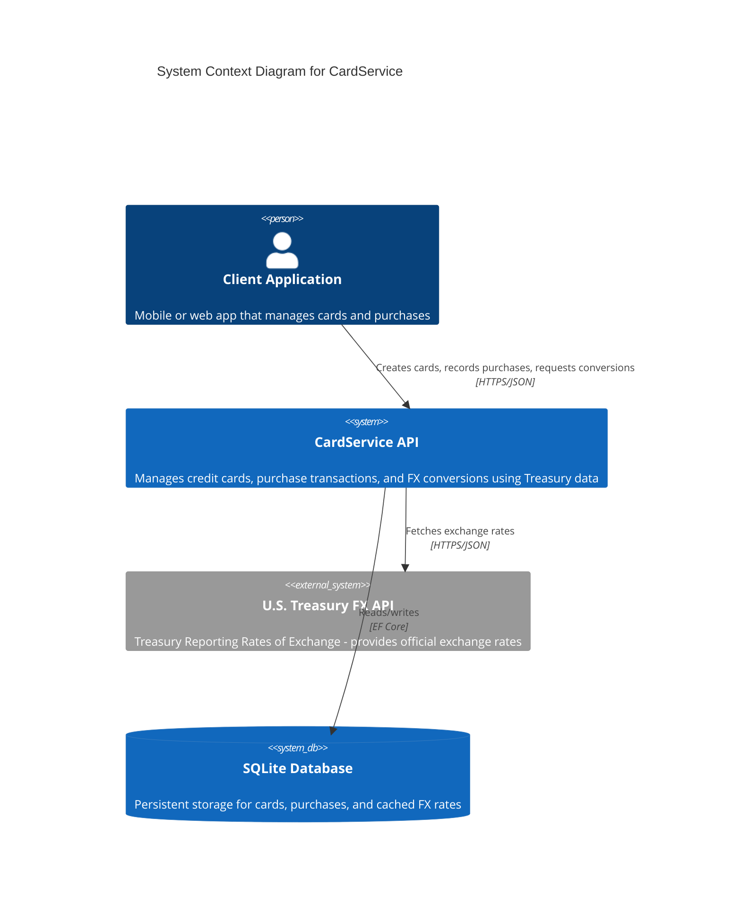

# C4 Context Diagram — CardService System

## Purpose
High-level view showing CardService in its environment with external actors and systems.

## Assumptions
- Client applications (mobile/web) interact via HTTPS/REST
- Treasury Reporting Rates of Exchange API is the authoritative FX data source
- SQLite is used for persistence (file-based, no external DB server)

## Diagram

## Key Interactions

1. **Client → CardService**: RESTful API calls for card/purchase management and currency conversion
2. **CardService → Treasury API**: On-demand FX rate retrieval (with caching and resilience policies)
3. **CardService → SQLite**: Persistence of cards, purchases, and cached FX rates

## Security Boundary
Card numbers are hashed before storage; only last 4 digits retained in plaintext.
