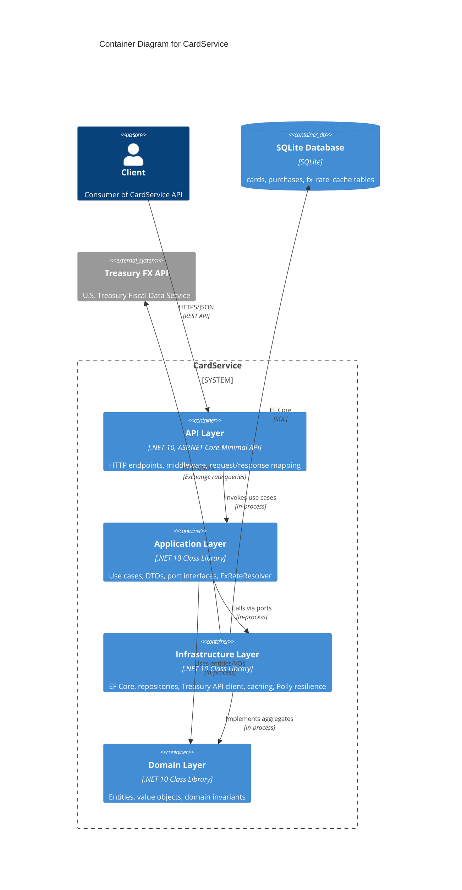

# C4 Container Diagram — CardService Containers

## Purpose
Shows the logical containers (deployable units) within CardService and their relationships.

## Assumptions
- Clean Architecture with strict layer dependencies: Domain ← Application ← Infrastructure ← API
- All containers run in a single process (ASP.NET Core)
- EF Core mediates all database access

## Diagram

## Layer Responsibilities

- **API**: Endpoint routing, request validation, error middleware, OpenAPI documentation
- **Application**: Orchestration (use cases), business workflows, DTO mapping, port definitions
- **Infrastructure**: Persistence (EF Core), external integrations (Treasury API), caching, resilience
- **Domain**: Business entities (`Card`, `PurchaseTransaction`), value objects (`Money`, `CardNumber`, `FxRate`), invariants

## Dependency Rules
High-level policies (use cases) depend only on abstractions. Infrastructure implements ports defined in Application.
