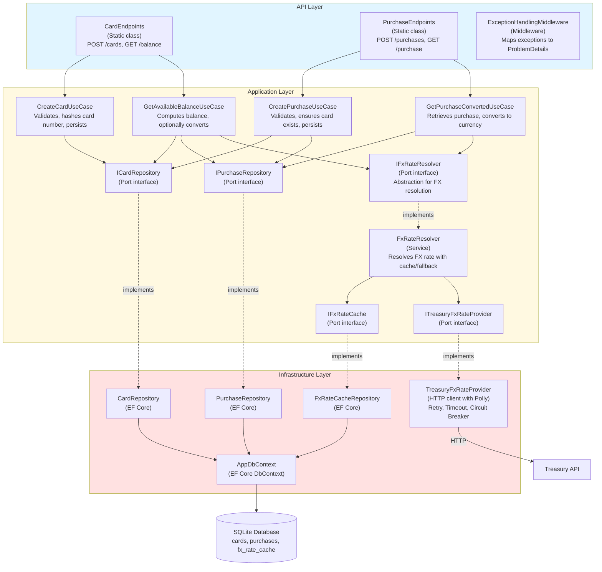

# C4 Component Diagram — CardService Components

## Purpose
Detailed component view within CardService showing key classes and their interactions.

## Assumptions
- Components are C# types (classes, interfaces)
- Use case classes implement application logic
- Repositories implement port interfaces for persistence
- FxRateResolver orchestrates FX rate retrieval with caching

## Diagram

## Key Component Responsibilities

### API Components
- **CardEndpoints**: Route mapping for card operations
- **PurchaseEndpoints**: Route mapping for purchase operations
- **ExceptionHandlingMiddleware**: Global exception handler with structured error codes

### Application Components
- **Use Cases**: Single-responsibility orchestrators (one per API operation)
- **FxRateResolver**: Encapsulates FX rate resolution logic with cache-first strategy
- **Port Interfaces**: Abstract persistence and external services

### Infrastructure Components
- **Repositories**: Concrete EF Core implementations of ports
- **TreasuryFxRateProvider**: HTTP client with Polly retry/timeout/circuit breaker
- **AppDbContext**: EF Core database session
