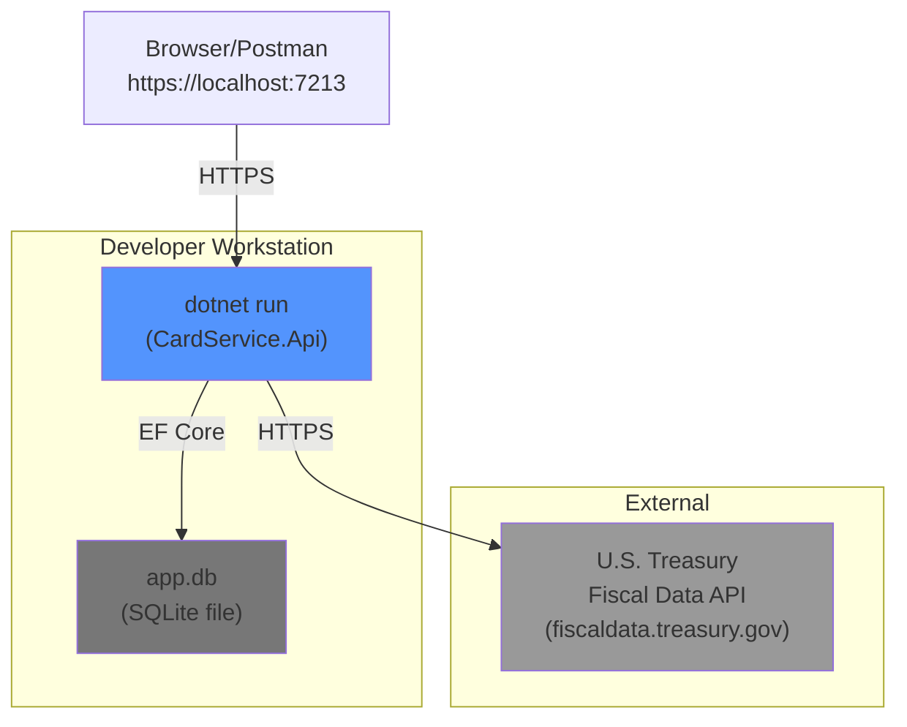
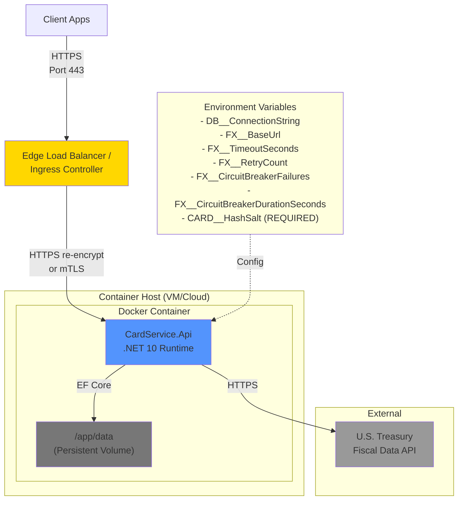

# Deployment Diagram — CardService

## Purpose
Shows deployment topologies and configuration inputs for different environments.

## Environments

### Local Development

**Configuration:**
- `DB__ConnectionString`: `Data Source=app.db`
- `FX__BaseUrl`: `https://api.fiscaldata.treasury.gov`
- `FX__TimeoutSeconds`: 2 (per-request timeout)
- `FX__RetryCount`: 2 (exponential backoff)
- `FX__CircuitBreakerFailures`: 5 (failures before break)
- `FX__CircuitBreakerDurationSeconds`: 30 (recovery wait)
- `CARD__HashSalt`: (optional in dev, required in prod)

### Containerized Deployment

**Container Configuration:**
- **Volume Mount**: `/app/data` for SQLite persistence
- **Port Mapping**: 8080 (container) exposed for HTTPS (TLS configured in app) OR 443 with TLS termination at ingress + re-encrypt
- **Transport Security**: Edge load balancer/ingress MUST either:
  1. Re-encrypt traffic to application (TLS end-to-end), OR
  2. Use mTLS for internal hop
  - **No plaintext HTTP between edge and application in Production**
- **Environment Variables** (REQUIRED in Production):
  - `DB__ConnectionString=Data Source=/app/data/cardservice.db`
  - `FX__BaseUrl=https://api.fiscaldata.treasury.gov`
  - `FX__TimeoutSeconds=2`
  - `FX__RetryCount=2`
  - `FX__CircuitBreakerFailures=5`
  - `FX__CircuitBreakerDurationSeconds=30`
  - `CARD__HashSalt=<secure-random-value>` **(REQUIRED - app will fail at startup if missing)**

## Configuration Sources

### Required Settings (Production Enforcement)
- **CARD__HashSalt**: Salt for card number hashing
  - **REQUIRED in Production** — Application fails at startup if missing or blank
  - Generate using: `openssl rand -hex 64` or equivalent cryptographically secure method
  - Store in secure configuration management (environment variables, secret manager, etc.)
- **DB__ConnectionString**: SQLite file path (optional, defaults to `Data Source=App_Data/app.db`)

### Optional Settings (with defaults)
- **FX__BaseUrl**: Treasury API base URL (default: `https://api.fiscaldata.treasury.gov`)
- **FX__TimeoutSeconds**: HTTP timeout per request (default: 2)
- **FX__RetryCount**: Number of retry attempts (default: 2)
- **FX__CircuitBreakerFailures**: Failures before circuit opens (default: 5)

## Health Checks

- **Liveness**: `/health`
- **Readiness**: `/health/ready` (checks DB connectivity)

## Runtime Requirements

- **.NET 10 Runtime**
- **SQLite native libraries** (bundled with Microsoft.Data.Sqlite)
- **Outbound HTTPS** access to `fiscaldata.treasury.gov`

## Security Considerations

- **TLS**: HTTPS required in production (terminate at load balancer/ingress)
- **Secrets**: Store `CARD__HashSalt` in secure vault (Azure Key Vault, AWS Secrets Manager, etc.)
- **Network**: Firewall egress to Treasury API only (whitelist `fiscaldata.treasury.gov`)
