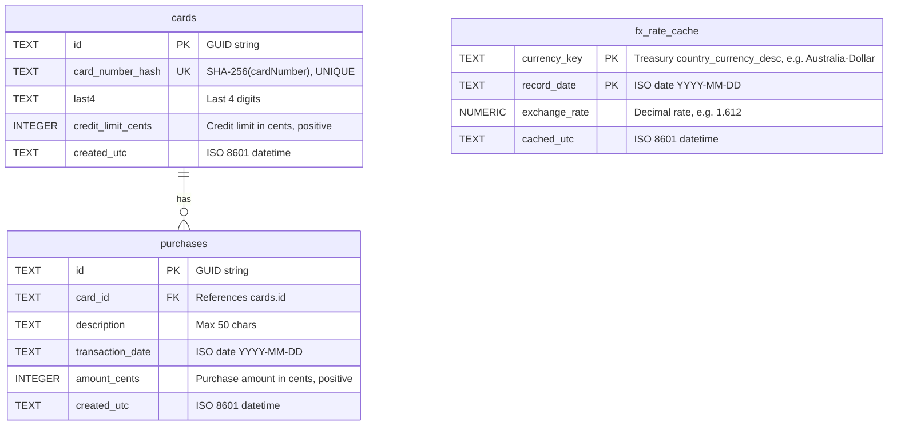

# Data Model ERD — CardService Schema

## Purpose
Entity-Relationship Diagram for the SQLite database schema.

## Assumptions
- EF Core manages schema with migrations
- Card numbers stored as SHA-256 hash (64 hex chars) + last 4 digits
- Money amounts stored as integer cents (avoiding floating-point errors)
- Composite PK on `fx_rate_cache` for efficient lookups

## Diagram



## Table Details

### cards
- **Primary Key**: `id` (GUID)
- **Unique Constraint**: `card_number_hash` (enforces no duplicate card numbers)
- **Indexes**:
  - Unique index on `card_number_hash`

### purchases
- **Primary Key**: `id` (GUID)
- **Foreign Key**: `card_id` → `cards.id` (no ON DELETE CASCADE; application-managed)
- **Indexes**:
  - `(card_id, transaction_date)` for balance calculations
  - `card_id` for aggregation queries

### fx_rate_cache
- **Composite Primary Key**: `(currency_key, record_date)`
  - Ensures only one rate per currency per date
- **Indexes**:
  - `(currency_key, record_date DESC)` for "latest rate ≤ date" queries

## Data Types & Constraints

### Money Handling
- All USD amounts stored as **INTEGER cents** to avoid floating-point rounding errors
- Application layer converts between decimal dollars and integer cents
- FX conversion: `convertedAmount = Round(amountUsdDecimal * exchangeRate, 2, MidpointRounding.AwayFromZero)`

### Card Number Security
- Plaintext card number **never stored**
- Storage: `SHA-256(cardNumber)` as 64-char hex string + `last4` for display
- Hash salt configured via `CARD__HashSalt` environment variable (required in production)

### Date Formats
- `transaction_date`, `record_date`: ISO date strings `YYYY-MM-DD`
- `created_utc`, `cached_utc`: ISO 8601 datetime with UTC offset

## Sample Data

```sql
-- cards table
INSERT INTO cards VALUES (
    '3fa85f64-5717-4562-b3fc-2c963f66afa6',
    'a665a45920422f9d417e4867efdc4fb8a04a1f3fff1fa07e998e86f7f7a27ae3', -- hash
    '1234',
    100000, -- $1,000.00
    '2024-12-01T10:00:00Z'
);

-- purchases table
INSERT INTO purchases VALUES (
    '7c9e6679-7425-40de-944b-e07fc1f90ae7',
    '3fa85f64-5717-4562-b3fc-2c963f66afa6', -- card_id
    'Coffee at Starbucks',
    '2024-12-20',
    450, -- $4.50
    '2024-12-20T14:30:00Z'
);

-- fx_rate_cache table
INSERT INTO fx_rate_cache VALUES (
    'Australia-Dollar',
    '2024-12-20',
    1.612,
    '2024-12-20T14:31:00Z'
);
```
