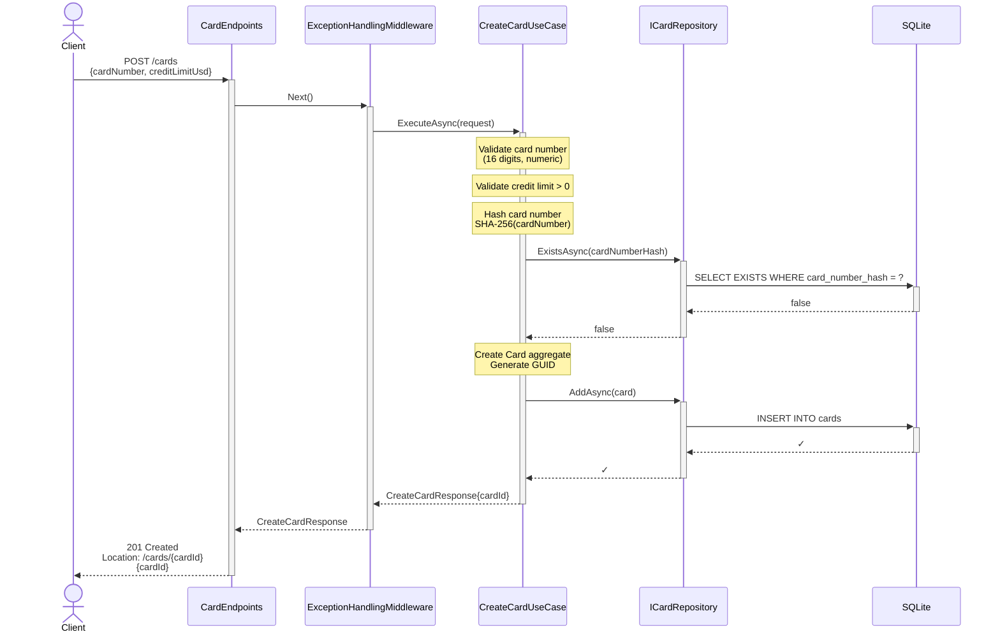
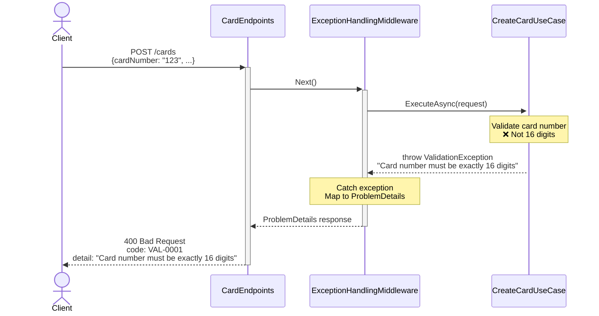
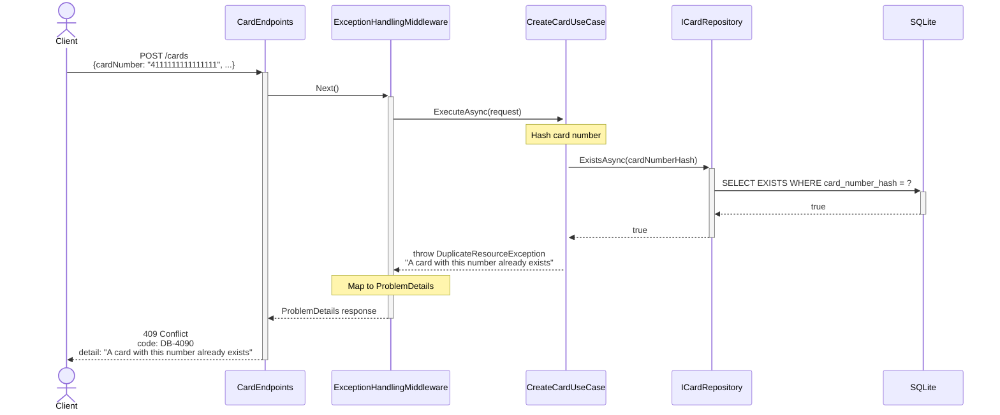

# Sequence Diagram — Create Card

## Purpose
Shows the flow for `POST /cards` including validation, hashing, persistence, and error handling.

## API Endpoint
```
POST /cards
Content-Type: application/json

{
  "cardNumber": "4111111111111111",
  "creditLimitUsd": 1000.00
}
```

## Happy Path



## Error Path — Validation Failure



## Error Path — Duplicate Card Number



## Key Steps

1. **Validation**: Card number (16 digits, numeric), credit limit (positive)
2. **Hashing**: SHA-256(cardNumber) with salt for uniqueness check
3. **Uniqueness Check**: Query DB for existing `card_number_hash`
4. **Aggregate Creation**: Domain `Card` entity with GUID and hashed number
5. **Persistence**: EF Core `INSERT` with unique constraint enforcement
6. **Response**: 201 Created with `Location` header and `cardId`

## Error Codes

- **VAL-0001** (400): Validation error (invalid card number, negative limit)
- **DB-4090** (409): Duplicate card number (hash collision detected)
