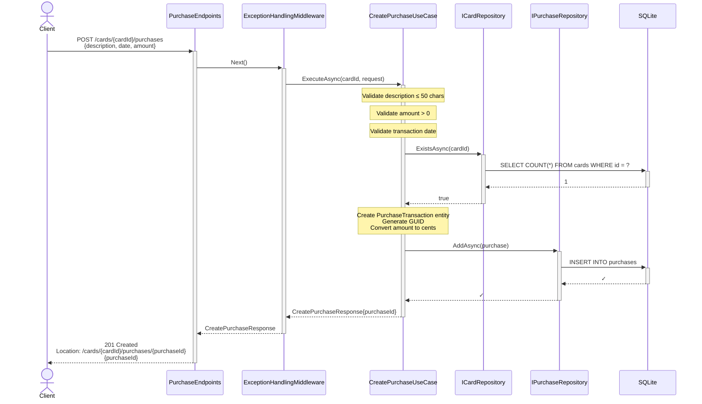
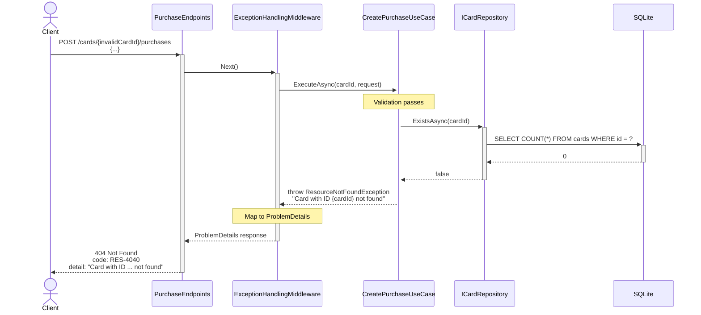
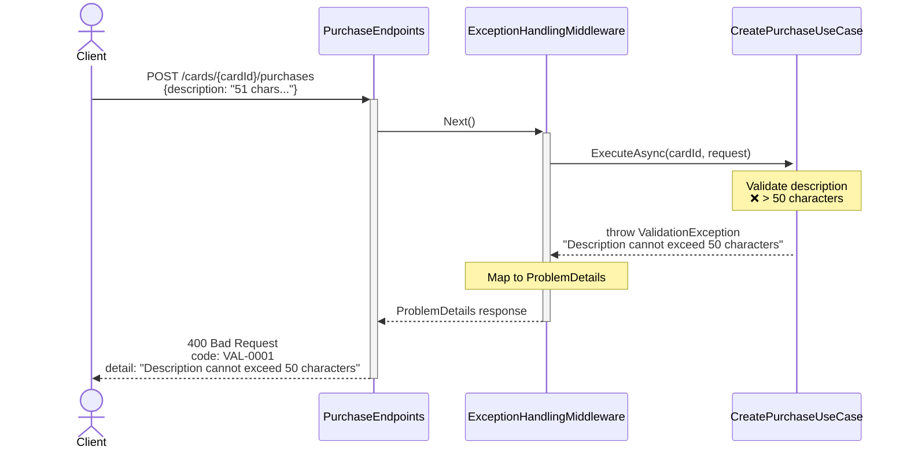

# Sequence Diagram — Create Purchase

## Purpose
Shows the flow for `POST /cards/{cardId}/purchases` including card existence check and validation.

## API Endpoint
```
POST /cards/3fa85f64-5717-4562-b3fc-2c963f66afa6/purchases
Content-Type: application/json

{
  "description": "Coffee at Starbucks",
  "transactionDate": "2024-12-20",
  "amountUsd": 4.50
}
```

## Happy Path



## Error Path — Card Not Found



## Error Path — Validation Failure



## Key Steps

1. **Validation**: Description length (≤50), amount (positive), date format
2. **Card Existence Check**: Query DB to ensure card exists before creating purchase
3. **Entity Creation**: Domain `PurchaseTransaction` with GUID, cents conversion
4. **Persistence**: EF Core `INSERT` with FK constraint to cards
5. **Response**: 201 Created with `Location` header and `purchaseId`

## Validation Rules

- **Description**: Non-empty, max 50 characters
- **TransactionDate**: Valid date format (ISO 8601 date-only)
- **AmountUsd**: Positive decimal, stored as integer cents
- **CardId**: Must reference existing card

## Error Codes

- **VAL-0001** (400): Validation error (description too long, negative amount, invalid date)
- **RES-4040** (404): Card not found
