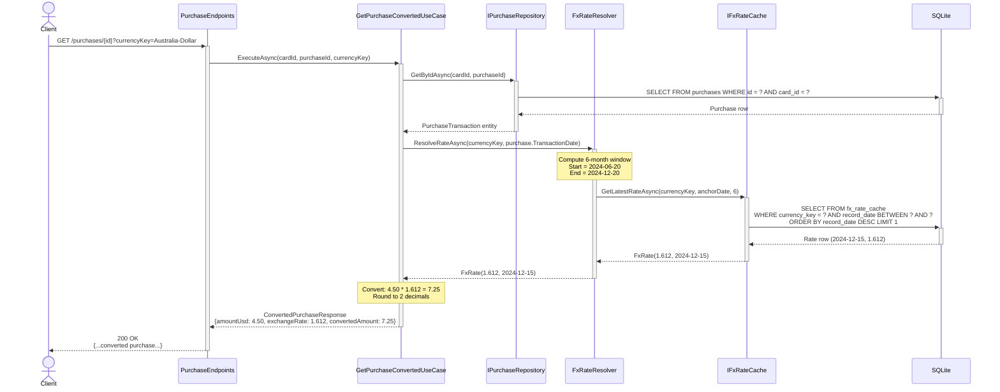
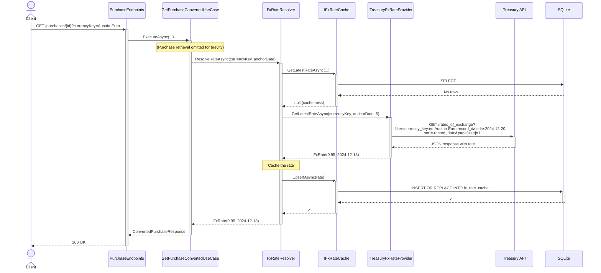
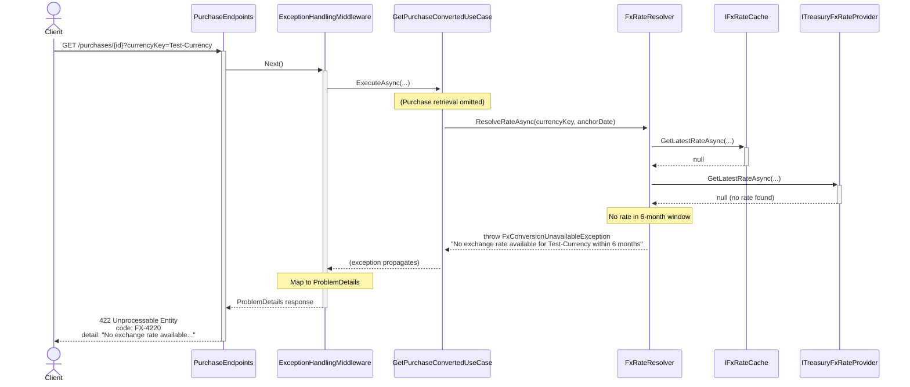
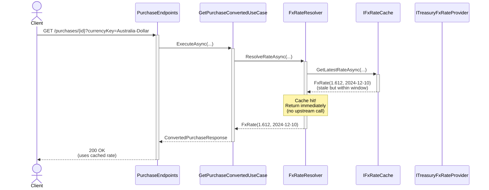
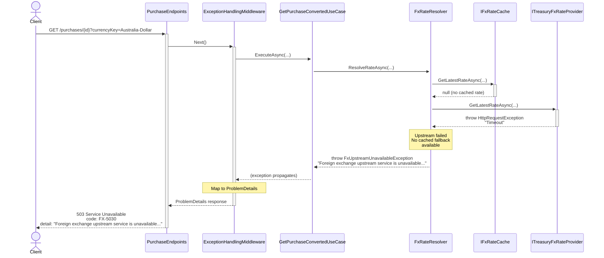

# Sequence Diagram — Get Purchase Converted

## Purpose
Shows the flow for `GET /cards/{cardId}/purchases/{purchaseId}?currencyKey=Australia-Dollar` with FX conversion logic including cache, upstream, fallback, and error scenarios.

## API Endpoint
```
GET /cards/3fa85f64-5717-4562-b3fc-2c963f66afa6/purchases/7c9e6679-7425-40de-944b-e07fc1f90ae7?currencyKey=Australia-Dollar
```

## Happy Path — Cache Hit



## Cache Miss — Upstream Success



## Error Path — No Rate in Window (422)



## Error Path — Upstream Failure with Cache Fallback (200)



## Error Path — Upstream Failure, No Cache (503)



## Key Steps

1. **Purchase Retrieval**: Query DB for purchase by composite key (cardId, purchaseId)
2. **FX Rate Resolution**: Cache-first strategy (see [10-activity-fx-resolution.md](./10-activity-fx-resolution.md))
3. **Conversion**: `convertedAmount = Round(amountUsd * exchangeRate, 2)`
4. **Response**: Original USD amount + rate + converted amount + rate date

## Error Codes

- **RES-4040** (404): Purchase not found or doesn't belong to specified card
- **FX-4220** (422): No exchange rate available in 6-month window
- **FX-5030** (503): Upstream unavailable and no cached fallback
