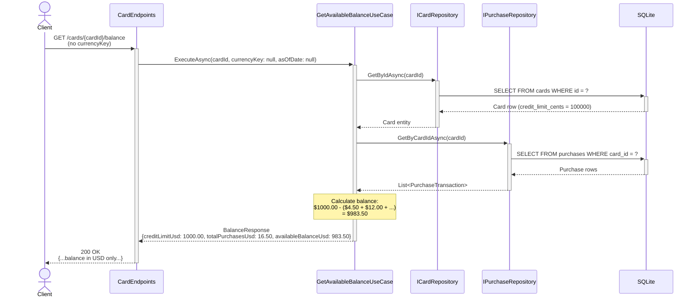
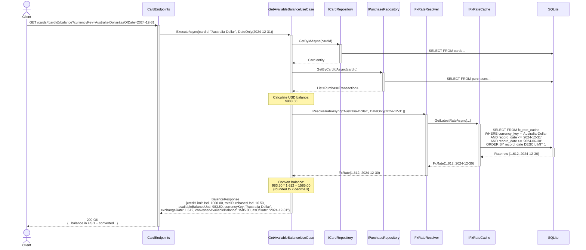
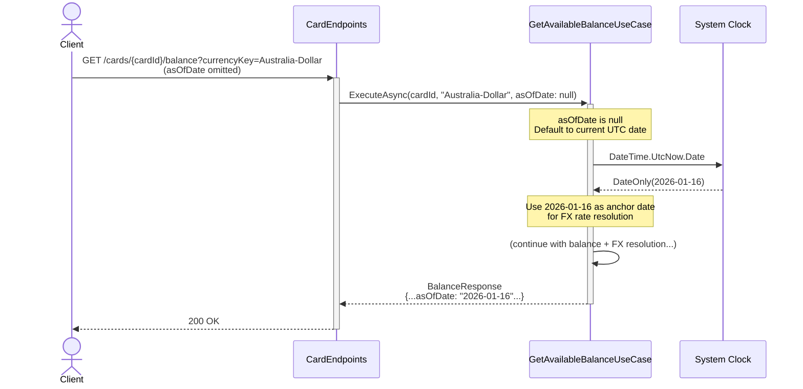
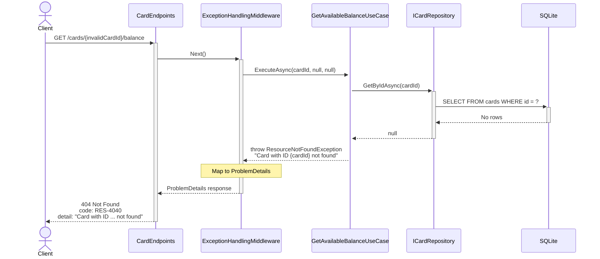
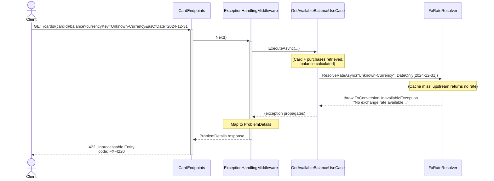

# Sequence Diagram — Get Available Balance

## Purpose
Shows the flow for `GET /cards/{cardId}/balance?currencyKey=Australia-Dollar&asOfDate=2024-12-31` with optional currency conversion.

## API Endpoint
```
GET /cards/3fa85f64-5717-4562-b3fc-2c963f66afa6/balance?currencyKey=Australia-Dollar&asOfDate=2024-12-31
```

## Happy Path — USD Balance (No Conversion)



## Happy Path — Balance with Conversion



## AsOfDate Defaulting



## Error Path — Card Not Found



## Error Path — FX Conversion Unavailable



## Key Steps

1. **Card Retrieval**: Query DB for card to get credit limit
2. **Purchase Aggregation**: Sum all purchases for the card
3. **Balance Calculation**: `availableBalanceUsd = creditLimitUsd - totalPurchasesUsd`
4. **Optional Conversion**: If `currencyKey` provided:
   - Default `asOfDate` to current UTC date if omitted
   - Resolve FX rate using `FxRateResolver`
   - Convert: `convertedBalance = Round(availableBalanceUsd * exchangeRate, 2)`
5. **Response**: USD balance always included; converted balance only if `currencyKey` provided

## Query Parameters

- **currencyKey** (optional): Treasury `country_currency_desc` (e.g., `Australia-Dollar`)
- **asOfDate** (optional): Anchor date for FX rate resolution; defaults to current UTC date

## Error Codes

- **RES-4040** (404): Card not found
- **FX-4220** (422): No exchange rate available in 6-month window (only if `currencyKey` provided)
- **FX-5030** (503): Upstream unavailable and no cached fallback (only if `currencyKey` provided)
