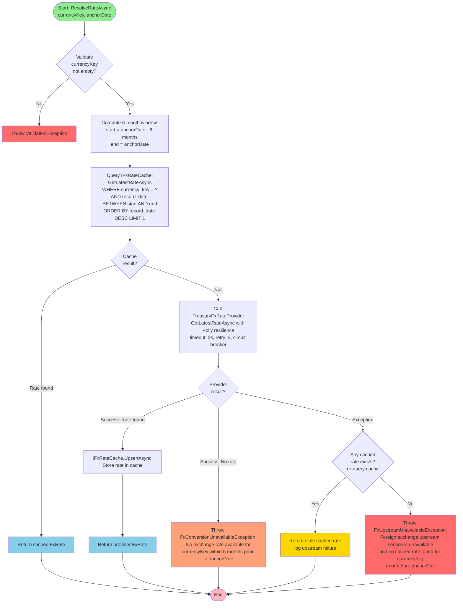

# Activity Diagram — FX Rate Resolution Algorithm

## Purpose
Detailed activity flow for `FxRateResolver.ResolveRateAsync()` showing cache-first strategy with upstream fallback.

## Algorithm Overview

The FX rate resolution follows a deterministic cache-first strategy with resilient upstream calls and error handling.

## Activity Flow



## Decision Points

### 1. Input Validation
- **Check**: `currencyKey` is not null/empty/whitespace
- **Fail Action**: Throw `ValidationException`

### 2. Cache Hit
- **Query**: Latest rate with `record_date ≤ anchorDate` within 6-month window
- **Hit**: Return immediately (no upstream call)
- **Miss**: Proceed to upstream provider

### 3. Provider Result
Three possible outcomes:

#### A. Success with Rate
- **Action**: Cache the rate via `UpsertAsync`
- **Return**: FxRate to caller

#### B. Success with No Rate
- **Meaning**: Upstream responded successfully but no data in 6-month window
- **Action**: Throw `FxConversionUnavailableException` (422)

#### C. Exception (Timeout, Network, HTTP Error)
- **Fallback Check**: Re-query cache for ANY rate (not limited to 6 months)
- **If Fallback Exists**: Return stale rate (resilience over freshness)
- **If No Fallback**: Throw `FxUpstreamUnavailableException` (503)

## Six-Month Window Calculation

```csharp
DateOnly anchorDate = purchase.TransactionDate; // e.g., 2024-12-20
DateOnly windowStart = anchorDate.AddMonths(-6); // 2024-06-20
DateOnly windowEnd = anchorDate; // 2024-12-20

// Query: WHERE record_date >= '2024-06-20' AND record_date <= '2024-12-20'
```

**Boundary behavior:**
- Inclusive on both ends
- 6 months calculated as calendar months (not 180 days)
- Example: Purchase on 2024-12-31, rate at 2024-06-30 is **valid** (exactly 6 months prior, inclusive)

## Rate Selection Logic

When multiple rates exist in the window:
- **SELECT**: `MAX(record_date)` — the **latest** rate before or on the anchor date
- **Sorting**: `ORDER BY record_date DESC LIMIT 1`

## Polly Resilience Policies

Applied to `ITreasuryFxRateProvider.GetLatestRateAsync()`:

1. **Timeout Policy**: 2 seconds per request
2. **Retry Policy**: 2 attempts with exponential backoff + jitter
3. **Circuit Breaker**: Open after 5 consecutive failures; half-open retry after 30 seconds

## Error Codes

- **VAL-0001** (400): Empty `currencyKey`
- **FX-4220** (422): No rate in 6-month window (upstream returned empty)
- **FX-5030** (503): Upstream failure + no cached fallback

## Cache Upsert Logic

```csharp
// Composite PK: (currency_key, record_date)
// INSERT OR REPLACE ensures idempotent cache updates
await _cache.UpsertAsync(new FxRate
{
    CurrencyKey = "Australia-Dollar",
    RecordDate = DateOnly.Parse("2024-12-20"),
    ExchangeRate = 1.612m,
    CachedUtc = DateTime.UtcNow
});
```

## Example Scenarios

### Scenario 1: Fresh Cache Hit
- **Anchor Date**: 2024-12-20
- **Cache**: Has rate for 2024-12-15 (within window)
- **Result**: Return cached rate (no upstream call)

### Scenario 2: Cache Miss, Upstream Success
- **Anchor Date**: 2024-12-20
- **Cache**: Empty
- **Upstream**: Returns rate for 2024-12-18
- **Actions**: Cache rate, return rate

### Scenario 3: No Rate in Window
- **Anchor Date**: 2024-12-20
- **Cache**: Empty
- **Upstream**: No data (country/currency not in dataset for that period)
- **Result**: 422 `FX-4220`

### Scenario 4: Upstream Timeout, Stale Cache Fallback
- **Anchor Date**: 2024-12-20
- **Cache**: Has rate for 2024-10-15 (outside 6-month window, but exists)
- **Upstream**: Timeout (network issue)
- **Fallback Query**: Find ANY cached rate for currency
- **Result**: 200 with stale cached rate (resilience prioritized)

### Scenario 5: Upstream Timeout, No Cache
- **Anchor Date**: 2024-12-20
- **Cache**: Empty
- **Upstream**: Timeout
- **Fallback Query**: No cached rate exists
- **Result**: 503 `FX-5030`
