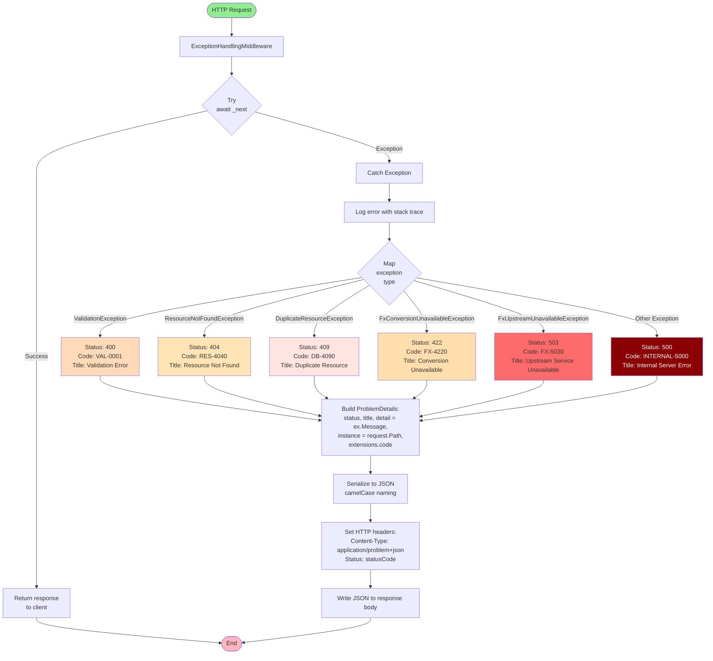

# Error Mapping Flowchart — Exception to ProblemDetails

## Purpose
Shows how `ExceptionHandlingMiddleware` maps domain/application exceptions to RFC 7807 Problem Details with stable error codes.

## Middleware Flow



## Exception-to-Status Mapping Table

| Exception Type | HTTP Status | Error Code | Title | Typical Causes |
|---|---|---|---|---|
| `ValidationException` | 400 | `VAL-0001` | Validation Error | Invalid card number, negative amount, description too long |
| `ResourceNotFoundException` | 404 | `RES-4040` | Resource Not Found | Card or purchase ID not found |
| `DuplicateResourceException` | 409 | `DB-4090` | Duplicate Resource | Card number already exists (hash collision) |
| `FxConversionUnavailableException` | 422 | `FX-4220` | Conversion Unavailable | No exchange rate within 6-month window |
| `FxUpstreamUnavailableException` | 503 | `FX-5030` | Upstream Service Unavailable | Treasury API timeout/failure + no cached fallback |
| *(All others)* | 500 | `INTERNAL-5000` | Internal Server Error | Unhandled exceptions, bugs |

## ProblemDetails Structure

```json
{
  "type": "https://tools.ietf.org/html/rfc7807",
  "title": "Validation Error",
  "status": 400,
  "detail": "Card number must be exactly 16 digits.",
  "instance": "/cards",
  "code": "VAL-0001"
}
```

### Fields

- **type**: URI reference identifying the problem type (default RFC 7807 URI)
- **title**: Short human-readable summary (stable across occurrences)
- **status**: HTTP status code (duplicated for convenience)
- **detail**: Specific error message from exception (may vary per occurrence)
- **instance**: URI of the request that triggered the error
- **code**: Stable, machine-readable error code for client-side handling

## Error Code Design Principles

1. **Stable Codes**: Never change existing codes; add new codes for new errors
2. **Namespaced**: Prefix indicates category (VAL=validation, RES=resource, DB=database, FX=foreign exchange)
3. **Numeric Suffix**: HTTP status included in code (e.g., `RES-4040` = resource 404)
4. **Client-Friendly**: Enables `switch(error.code)` logic in client applications

## Middleware Implementation

```csharp
public class ExceptionHandlingMiddleware
{
    private readonly RequestDelegate _next;
    private readonly ILogger<ExceptionHandlingMiddleware> _logger;

    public async Task InvokeAsync(HttpContext context)
    {
        try
        {
            await _next(context);
        }
        catch (Exception ex)
        {
            _logger.LogError(ex, "An error occurred processing the request.");
            await HandleExceptionAsync(context, ex);
        }
    }

    private async Task HandleExceptionAsync(HttpContext context, Exception exception)
    {
        var (statusCode, code, title) = exception switch
        {
            ValidationException => (400, "VAL-0001", "Validation Error"),
            ResourceNotFoundException => (404, "RES-4040", "Resource Not Found"),
            DuplicateResourceException => (409, "DB-4090", "Duplicate Resource"),
            FxConversionUnavailableException => (422, "FX-4220", "Conversion Unavailable"),
            FxUpstreamUnavailableException => (503, "FX-5030", "Upstream Service Unavailable"),
            _ => (500, "INTERNAL-5000", "Internal Server Error")
        };

        var problemDetails = new ProblemDetails
        {
            Status = statusCode,
            Title = title,
            Detail = exception.Message,
            Instance = context.Request.Path
        };
        problemDetails.Extensions["code"] = code;

        context.Response.StatusCode = statusCode;
        context.Response.ContentType = "application/problem+json";
        await context.Response.WriteAsync(JsonSerializer.Serialize(problemDetails));
    }
}
```

## Logging Behavior

- **All exceptions** are logged at `ERROR` level with full stack trace
- Log entry includes request path and correlation ID (if available)
- Sensitive data (card numbers, credentials) **never logged**

## Client Error Handling Example

```typescript
// Client-side TypeScript example
async function createCard(cardNumber: string, creditLimit: number) {
  const response = await fetch('/cards', {
    method: 'POST',
    body: JSON.stringify({ cardNumber, creditLimitUsd: creditLimit })
  });

  if (!response.ok) {
    const problem = await response.json();
    switch (problem.code) {
      case 'VAL-0001':
        // Show validation error to user
        alert(`Validation failed: ${problem.detail}`);
        break;
      case 'DB-4090':
        // Card already exists
        alert('This card number is already registered.');
        break;
      default:
        // Generic error
        alert(`Error: ${problem.title}`);
    }
    return;
  }

  const result = await response.json();
  console.log('Card created:', result.cardId);
}
```

## Benefits of Structured Error Responses

1. **Consistency**: All errors follow RFC 7807 standard
2. **Machine-Readable**: `code` field enables programmatic handling
3. **Human-Readable**: `title` and `detail` provide context for debugging
4. **Traceable**: `instance` field links error to specific request
5. **Evolvable**: New error codes can be added without breaking existing clients
