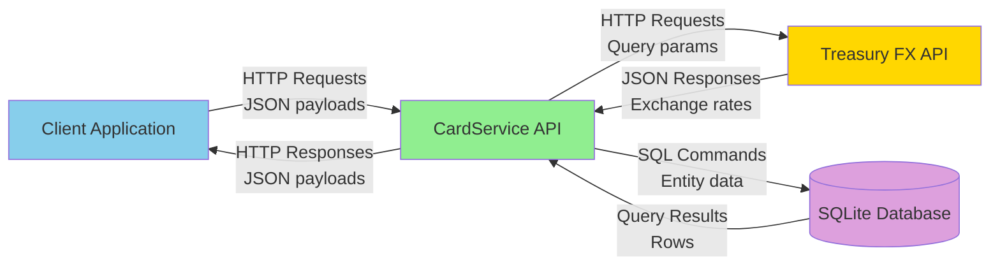
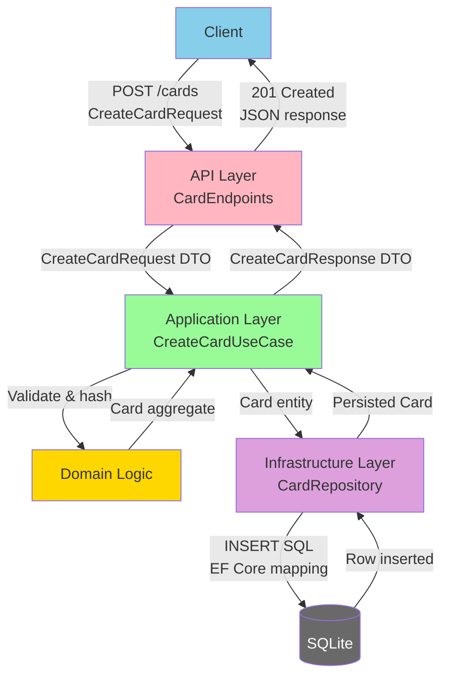
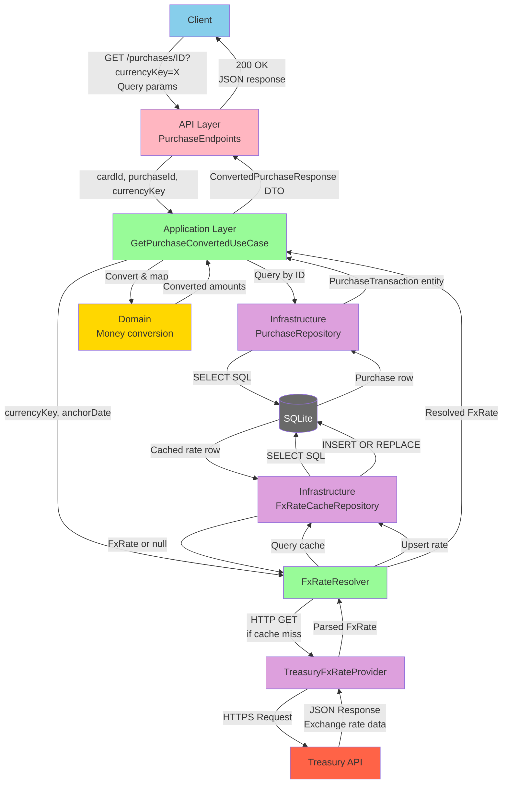
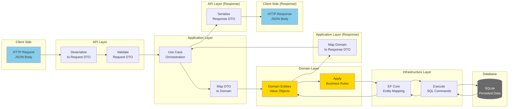
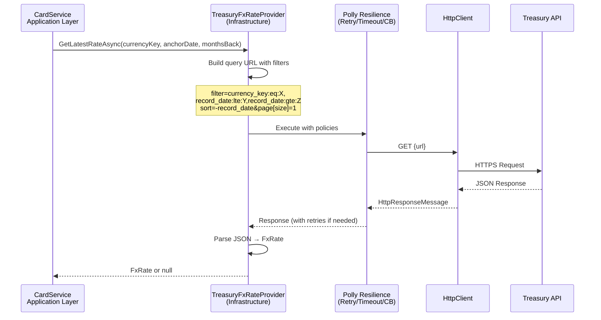

# Data Flow Diagram — Layer-to-Layer Data Movement

## Purpose
Shows how data flows through the Clean Architecture layers for typical operations.

## Level 0 — System Context Data Flow



## Level 1 — Internal Layer Data Flow

### Create Card Flow



### Get Purchase Converted Flow



## Data Transformation Pipeline

### Request → Response Flow



## Data Types by Layer

### API Layer (DTOs)
```csharp
// Request DTOs
CreateCardRequest { string CardNumber; decimal CreditLimitUsd; }
CreatePurchaseRequest { string Description; DateOnly TransactionDate; decimal AmountUsd; }

// Response DTOs
CreateCardResponse { Guid CardId; }
ConvertedPurchaseResponse { Guid PurchaseId; string Description; decimal AmountUsd; string CurrencyKey; decimal ExchangeRate; decimal ConvertedAmount; }
```

### Application Layer (DTOs + Domain References)
```csharp
// Use cases work with DTOs + Domain entities
UseCase.ExecuteAsync(RequestDTO dto) → ResponseDTO
// Internally: Domain entities, value objects, port calls
```

### Domain Layer (Pure Business Logic)
```csharp
// Entities
Card { CardId, CardNumber, CreditLimit, Purchases }
PurchaseTransaction { PurchaseId, CardId, Description, TransactionDate, Amount }

// Value Objects
Money { Amount, Currency }
CardNumber { Value (16 digits) }
FxRate { CurrencyKey, RecordDate, ExchangeRate }
```

### Infrastructure Layer (EF Core Entities)
```csharp
// EF Core entity configurations
CardConfiguration : IEntityTypeConfiguration<Card>
// Maps Domain.Card → Database.cards table
// Handles card_number_hash storage, cents conversion
```

### Database Layer (SQLite Schema)
```sql
-- Persisted as rows
cards: id, card_number_hash, last4, credit_limit_cents, created_utc
purchases: id, card_id, description, transaction_date, amount_cents, created_utc
fx_rate_cache: currency_key, record_date, exchange_rate, cached_utc
```

## External Data Flow

### Treasury API Integration



**Request Example:**
```
GET https://api.fiscaldata.treasury.gov/services/api/fiscal_service/v1/accounting/od/rates_of_exchange
?filter=country_currency_desc:eq:Australia-Dollar,record_date:lte:2024-12-20,record_date:gte:2024-06-20
&sort=-record_date
&page[size]=1
```

**Response Example:**
```json
{
  "data": [
    {
      "country_currency_desc": "Australia-Dollar",
      "exchange_rate": "1.612",
      "record_date": "2024-12-15"
    }
  ]
}
```

## Data Volume Estimates

### Typical Operation Data Sizes

| Operation | Request Size | Response Size | DB Reads | DB Writes |
|---|---|---|---|---|
| Create Card | 50 bytes | 50 bytes | 1 SELECT | 1 INSERT |
| Create Purchase | 100 bytes | 50 bytes | 2 SELECTs | 1 INSERT |
| Get Purchase Converted | 20 bytes | 200 bytes | 3 SELECTs | 0-1 INSERT |
| Get Balance | 20 bytes | 150 bytes | 2 SELECTs + 1 aggregate | 0 |

### Database Growth
- **Cards**: ~150 bytes/row (GUID + hash + metadata)
- **Purchases**: ~200 bytes/row
- **FX Cache**: ~100 bytes/row
- **Indexes**: 30-50% overhead

Example: 10,000 cards × 100 purchases each = 1M purchases ≈ 250 MB database file
