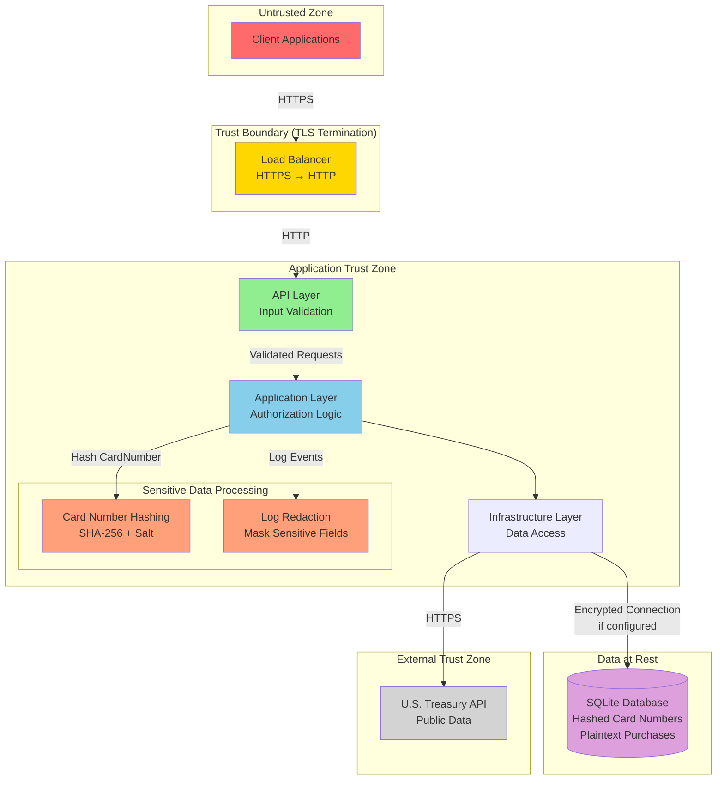
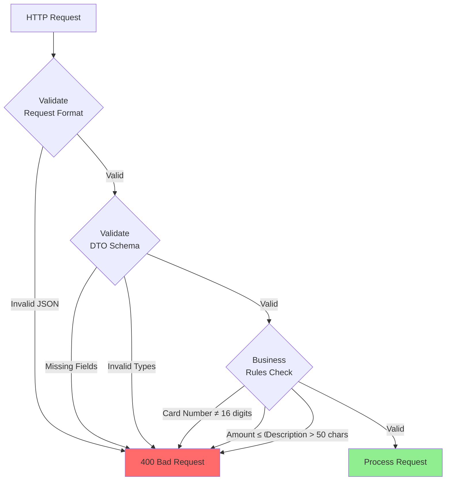
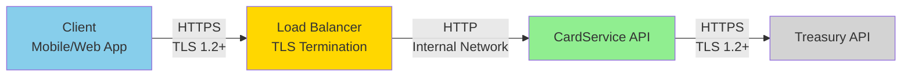

# Security Boundaries — CardService

## Purpose
Documents security controls, sensitive data handling, and security boundaries within CardService.

## Security Architecture



## Sensitive Data Inventory

### Personally Identifiable Information (PII)

| Data Element | Storage | Protection | Exposure Risk |
|---|---|---|---|
| **Card Number (full 16 digits)** | ❌ Never stored | SHA-256 hashed before persistence | **High** — PCI DSS scope |
| **Card Number (last 4 digits)** | ✅ Plaintext in DB | Display purposes only | **Low** — Industry standard |
| **Card Number Hash** | ✅ Stored (64-char hex) | Salted SHA-256 | **Low** — Not reversible |
| **Purchase Description** | ✅ Plaintext in DB | None (user-controlled text) | **Low** — Business data |
| **Purchase Amount** | ✅ Plaintext in DB | None (transactional data) | **Low** — Business data |
| **Credit Limit** | ✅ Plaintext in DB | None (business policy) | **Low** — Business data |

### Secrets and Credentials

| Secret | Storage | Access Control |
|---|---|---|
| **CARD__HashSalt** | Environment variable / Key Vault | **Required in production** (throws startup exception if missing); dev uses safe default |
| **DB__ConnectionString** | Environment variable | May contain file path or credentials |
| **FX__BaseUrl** | Configuration | Public URL (no secret) |
| **FX__TimeoutSeconds** | Configuration | 2 seconds (per-request) |
| **FX__RetryCount** | Configuration | 2 attempts with exponential backoff |
| **FX__CircuitBreakerFailures** | Configuration | 5 consecutive failures before opening circuit |
| **FX__CircuitBreakerDurationSeconds** | Configuration | 30 seconds break period for circuit recovery |

## Card Number Hashing

### Implementation

```csharp
public static class CardNumberHasher
{
    public static string ComputeHash(string cardNumber, string salt)
    {
        using var sha256 = SHA256.Create();
        var saltedCardNumber = cardNumber + salt;
        var hashBytes = sha256.ComputeHash(Encoding.UTF8.GetBytes(saltedCardNumber));
        return Convert.ToHexString(hashBytes).ToLowerInvariant();
    }
}
```

### Properties

- **Algorithm**: SHA-256 (collision-resistant)
- **Salt**: Configured via `CARD__HashSalt` environment variable
  - **Production**: REQUIRED at startup (throws `InvalidOperationException` if missing)
  - **Development**: Uses safe default `"dev-only-salt-not-for-production"` if not configured
- **Output**: 64-character uppercase hexadecimal string
- **Uniqueness Enforcement**: Database `UNIQUE` constraint on `card_number_hash`

### Attack Resistance

| Attack Vector | Mitigation |
|---|---|
| **Rainbow Tables** | Salt makes precomputed tables infeasible |
| **Hash Collision** | SHA-256 collision resistance (2^256 space) |
| **Timing Attacks** | Not applicable (hashing is deterministic, no comparison timing leak) |
| **Database Dump** | Hash + salt required to reverse; salt stored separately (env var) |

### Storage Schema

```sql
-- cards table
CREATE TABLE cards (
    id TEXT PRIMARY KEY,
    card_number_hash TEXT NOT NULL UNIQUE, -- SHA-256(cardNumber + salt)
    last4 TEXT NOT NULL,                  -- Last 4 digits (display only)
    credit_limit_cents INTEGER NOT NULL,
    created_utc TEXT NOT NULL
);
```

**Why Last 4 Digits?**
- Industry-standard practice for user-facing identification
- Insufficient for card number reconstruction
- Enables support queries ("Which card ending in 1234?")

## Input Validation Security

### API Layer Validation



### Validation Rules (Defense in Depth)

| Field | Validation | Layer |
|---|---|---|
| Card Number | 16 numeric digits | API + Domain |
| Credit Limit | Positive decimal | API + Domain |
| Description | Non-empty, ≤50 chars | API + Domain |
| Amount | Positive decimal | API + Domain |
| Transaction Date | Valid date format | API |
| Currency Key | Non-empty string | Application |

**Multi-Layer Validation:**
1. **API Layer**: Request DTO validation (format, types, required fields)
2. **Domain Layer**: Invariant enforcement (16-digit card number, positive amounts)
3. **Database Layer**: Constraints (NOT NULL, CHECK, UNIQUE)

## Logging and Audit Security

### Log Redaction

```csharp
public static class LogRedactor
{
    public static string RedactCardNumber(string message)
    {
        // Replace 16-digit sequences with "****-****-****-XXXX"
        var pattern = @"\b\d{16}\b";
        return Regex.Replace(message, pattern, match =>
        {
            var cardNumber = match.Value;
            return $"****-****-****-{cardNumber.Substring(12)}";
        });
    }
}
```

### What is Logged

| Event | Data Logged | Redacted? |
|---|---|---|
| Card Created | Card ID, last 4 digits | ✅ Full number never logged |
| Purchase Created | Card ID, purchase ID, amount | ❌ Amount is business data |
| FX Rate Retrieved | Currency key, rate, date | ❌ Public data |
| Validation Error | Error message | ✅ Redact card numbers in messages |
| Exception | Stack trace, exception message | ✅ Redact sensitive fields |

### Log Levels

- **INFO**: Successful operations (card created, purchase created)
- **WARNING**: Upstream failures, cache fallbacks
- **ERROR**: Exceptions with stack traces (redacted)

**Never Log:**
- Full card numbers (plaintext)
- Hash salts
- Database credentials
- PII in error messages

## Transport Security

### TLS Requirements



**Configuration:**
- **Client → Load Balancer**: TLS 1.2 or 1.3 (TLS 1.0/1.1 disabled)
- **CardService → Treasury**: HTTPS enforced (certificates validated)
- **Internal Communication**: Plain HTTP acceptable if on trusted network; otherwise TLS

### Certificate Validation

```csharp
// TreasuryFxRateProvider configuration
services.AddHttpClient<ITreasuryFxRateProvider, TreasuryFxRateProvider>()
    .ConfigurePrimaryHttpMessageHandler(() => new HttpClientHandler
    {
        ServerCertificateCustomValidationCallback = 
            HttpClientHandler.DangerousAcceptAnyServerCertificateCallback // ❌ DEV ONLY
        // PROD: Use default validation (validates against trusted CAs)
    });
```

## Data at Rest Security

### Database Encryption

**Option 1: SQLite Encryption Extension (SEE)**
- Requires commercial SQLite Encryption Extension
- Transparent encryption of entire database file
- Key managed via environment variable

**Option 2: File System Encryption**
- Linux: LUKS, dm-crypt
- Windows: BitLocker, EFS
- Cloud: AWS EBS encryption, Azure Disk Encryption

**Current Implementation:**
- No built-in SQLite encryption (open-source edition)
- Recommendation: Use OS/filesystem encryption in production

### Backup Security

- Database backups must be encrypted
- Backups stored in secure location (S3 with encryption, Azure Blob with encryption)
- Access controlled via IAM/RBAC

## Authorization (Not Implemented)

**Design Consideration:**
Current implementation has **no authentication or authorization**. For production:

1. **API Key Authentication**
   - Each client gets unique API key
   - Rate limiting per API key

2. **JWT Bearer Tokens**
   - OAuth 2.0 / OpenID Connect
   - Claims-based authorization (e.g., `cardId` in JWT claims)

3. **Row-Level Security**
   - Ensure users can only access their own cards/purchases
   - Filter queries by `userId` claim

```csharp
// Hypothetical authorization
[Authorize]
public async Task<BalanceResponse> GetBalance(Guid cardId)
{
    var userId = User.FindFirst("sub")?.Value;
    // Verify cardId belongs to userId
    var card = await _cardRepo.GetByIdAsync(cardId);
    if (card.UserId != userId)
        throw new ForbiddenException();
    // ...
}
```

## Threat Model Summary

| Threat | Mitigation | Residual Risk |
|---|---|---|
| **Card Number Exposure** | SHA-256 hashing with salt; never log plaintext | **Low** |
| **SQL Injection** | EF Core parameterized queries | **Very Low** |
| **XSS / CSRF** | Not applicable (API-only, no browser rendering) | **N/A** |
| **Man-in-the-Middle** | TLS 1.2+ enforced | **Low** |
| **Database Dump** | Hashed card numbers; recommend disk encryption | **Medium** (without disk encryption) |
| **Brute Force** | Not applicable (no auth currently) | **N/A** |
| **DDoS** | Rate limiting (not implemented); recommend at ingress | **High** (without rate limiting) |
| **Insider Threat** | Audit logs; access control to env vars | **Medium** |

## Security Checklist for Production

- [ ] Configure `CARD__HashSalt` with cryptographically random 32+ character string
- [ ] Enable TLS 1.2+ for all external traffic
- [ ] Implement database disk encryption (filesystem or SQLite SEE)
- [ ] Configure log redaction for sensitive fields
- [ ] Add authentication/authorization middleware
- [ ] Enable rate limiting at API gateway
- [ ] Encrypt database backups
- [ ] Rotate `CARD__HashSalt` periodically (requires re-hash migration)
- [ ] Conduct penetration testing
- [ ] Implement SIEM integration for security events
