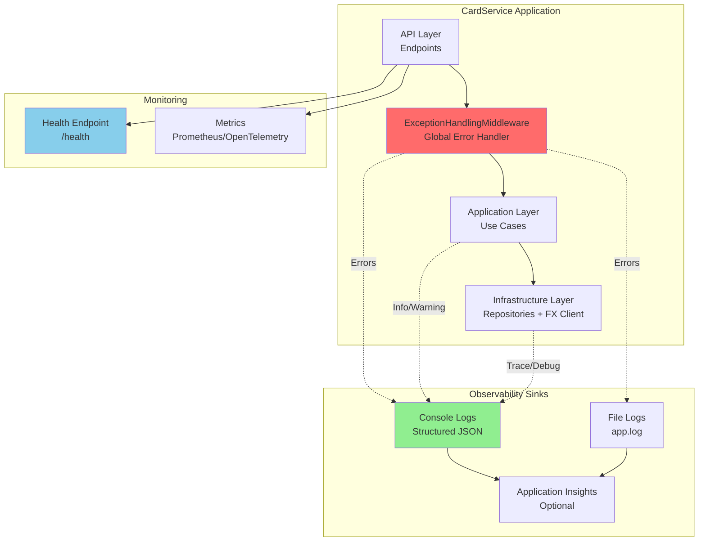
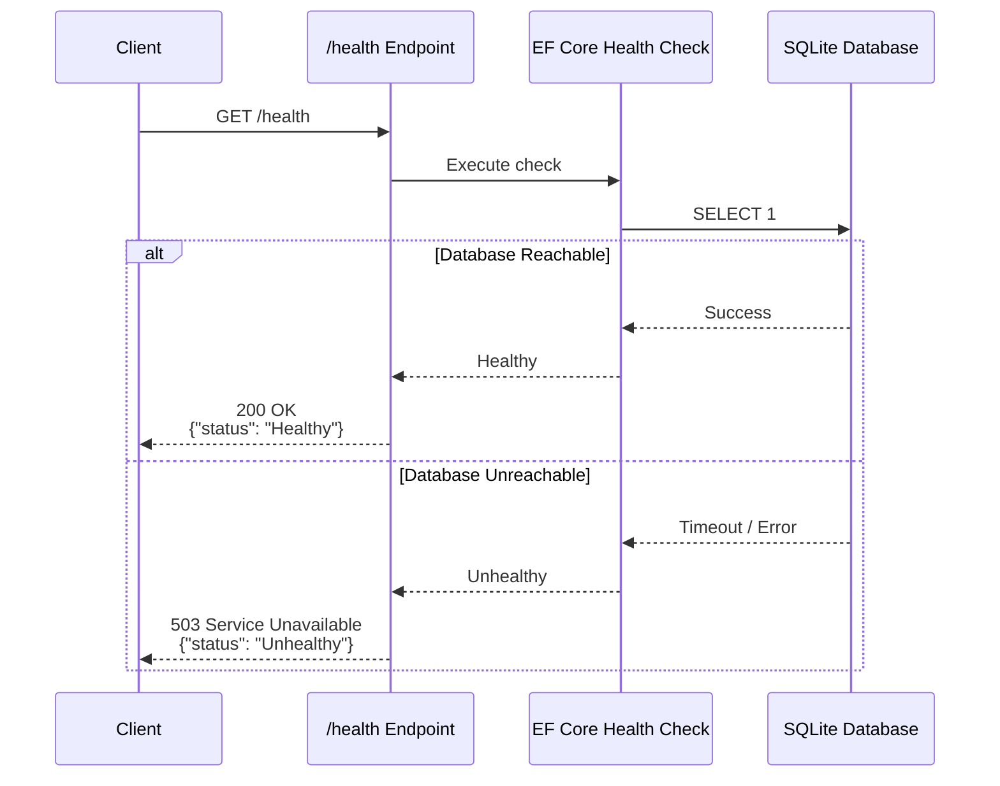
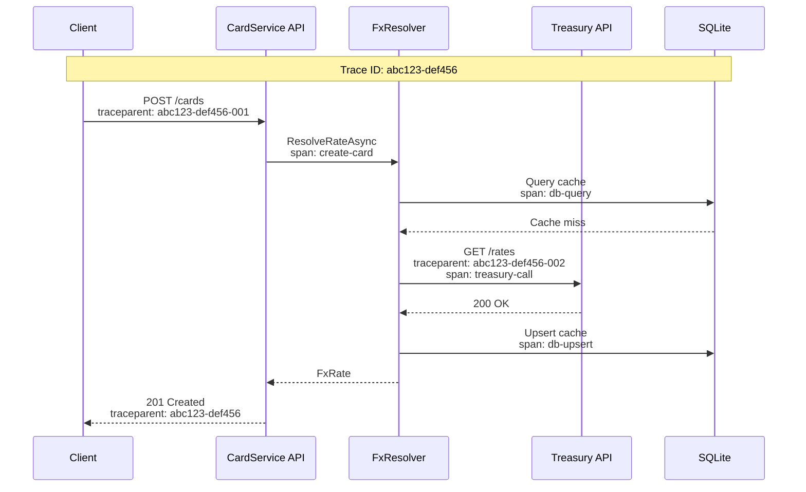

# Observability — CardService

## Purpose
Documents logging, health checks, metrics, and tracing touchpoints for operational visibility.

## Observability Architecture



## Logging Strategy

### Log Levels

| Level | Usage | Examples |
|---|---|---|
| **TRACE** | Internal method entry/exit | `Entering ResolveRateAsync(currencyKey={key}, anchorDate={date})` |
| **DEBUG** | Detailed flow (dev/test) | `Cache query returned 0 rows for currency_key={key}` |
| **INFO** | Normal operations | `Card created: cardId={id}, last4={last4}` |
| **WARNING** | Recoverable issues | `Treasury API timeout; attempting cache fallback` |
| **ERROR** | Exceptions / failures | `FX upstream unavailable; no cached fallback available` |

### Structured Logging

```json
{
  "timestamp": "2024-12-31T23:59:59.999Z",
  "level": "Information",
  "message": "Card created",
  "properties": {
    "cardId": "a1b2c3d4-e5f6-7890-abcd-ef1234567890",
    "last4": "1234",
    "creditLimitCents": 100000,
    "correlationId": "req-abc123"
  },
  "scope": "CardService.Application.UseCases.CreateCardUseCase"
}
```

**Key Properties:**
- `correlationId`: Unique ID per request (HTTP header `X-Correlation-ID` or generated)
- `cardId`, `purchaseId`: Entity identifiers
- `currencyKey`, `rateDate`: FX resolution context
- `errorCode`: Stable error codes (VAL-0001, FX-4220, etc.)
- `duration`: Request processing time (milliseconds)

### Logging Touchpoints

#### 1. API Layer (Minimal Endpoints)

```csharp
app.MapPost("/cards", async (CreateCardRequest request, ...) =>
{
    _logger.LogInformation("Received CreateCard request: cardNumber=***{Last4}", 
        request.CardNumber.Substring(12));
    
    var result = await _createCardUseCase.ExecuteAsync(request);
    
    _logger.LogInformation("Card created: cardId={CardId}, last4={Last4}", 
        result.CardId, result.Last4);
    
    return Results.Created($"/cards/{result.CardId}", result);
});
```

**Logged Events:**
- Request received (with redacted card number)
- Card created (success)
- Validation errors (handled by middleware)

#### 2. ExceptionHandlingMiddleware

```csharp
public async Task InvokeAsync(HttpContext context)
{
    try
    {
        await _next(context);
    }
    catch (Exception ex)
    {
        _logger.LogError(ex, 
            "Unhandled exception: {ExceptionType}, Path={Path}, Method={Method}, ErrorCode={ErrorCode}",
            ex.GetType().Name,
            context.Request.Path,
            context.Request.Method,
            GetErrorCode(ex));
        
        await HandleExceptionAsync(context, ex);
    }
}
```

**Logged Events:**
- All exceptions with full stack trace
- HTTP status code and error code
- Request path and method

#### 3. Application Use Cases

```csharp
public async Task<ConvertedPurchaseResponse> ExecuteAsync(Guid cardId, Guid purchaseId, string currencyKey)
{
    _logger.LogInformation(
        "GetPurchaseConverted: cardId={CardId}, purchaseId={PurchaseId}, currencyKey={CurrencyKey}",
        cardId, purchaseId, currencyKey);
    
    var purchase = await _purchaseRepo.GetByIdAsync(purchaseId);
    if (purchase == null)
    {
        _logger.LogWarning("Purchase not found: purchaseId={PurchaseId}", purchaseId);
        throw new NotFoundException($"Purchase {purchaseId} not found");
    }
    
    var fxRate = await _fxResolver.ResolveRateAsync(currencyKey, purchase.TransactionDate);
    _logger.LogInformation(
        "FX rate resolved: currencyKey={CurrencyKey}, rateDate={RateDate}, rate={Rate}",
        currencyKey, fxRate.RecordDate, fxRate.ExchangeRate);
    
    // Conversion logic...
    
    return response;
}
```

**Logged Events:**
- Use case invocation (INFO)
- Entity not found (WARNING)
- FX rate resolution success (INFO)
- Conversion result (INFO)

#### 4. FxRateResolver

```csharp
public async Task<FxRate> ResolveRateAsync(string currencyKey, DateOnly anchorDate)
{
    _logger.LogDebug("Resolving FX rate: currencyKey={CurrencyKey}, anchorDate={AnchorDate}", 
        currencyKey, anchorDate);
    
    var cachedRate = await QueryCacheAsync(currencyKey, anchorDate);
    if (cachedRate != null)
    {
        _logger.LogInformation("FX rate found in cache: currencyKey={CurrencyKey}, rateDate={RateDate}", 
            currencyKey, cachedRate.RecordDate);
        return cachedRate;
    }
    
    _logger.LogDebug("Cache miss; calling upstream provider");
    
    try
    {
        var upstreamRate = await _provider.GetRateAsync(currencyKey, anchorDate);
        if (upstreamRate != null)
        {
            await UpsertCacheAsync(upstreamRate);
            _logger.LogInformation("FX rate retrieved from upstream and cached");
            return upstreamRate;
        }
        
        _logger.LogWarning("No FX rate available within 6-month window: currencyKey={CurrencyKey}", 
            currencyKey);
        throw new ConversionUnavailableException($"No exchange rate for {currencyKey}");
    }
    catch (HttpRequestException ex)
    {
        _logger.LogWarning(ex, "Treasury API failure; attempting cache fallback");
        
        var fallbackRate = await QueryStaleRateAsync(currencyKey, anchorDate);
        if (fallbackRate != null)
        {
            _logger.LogInformation("Using stale cache fallback: rateDate={RateDate}", 
                fallbackRate.RecordDate);
            return fallbackRate;
        }
        
        _logger.LogError("No cached fallback available; upstream failure unrecoverable");
        throw new FxUpstreamUnavailableException("FX service unavailable", ex);
    }
}
```

**Logged Events:**
- Cache query (DEBUG)
- Cache hit (INFO)
- Cache miss (DEBUG)
- Upstream call success (INFO)
- Upstream failure (WARNING)
- Fallback success (INFO)
- Fallback failure (ERROR)

#### 5. TreasuryFxRateProvider

```csharp
public async Task<FxRate?> GetRateAsync(string currencyKey, DateOnly anchorDate)
{
    var url = BuildQueryUrl(currencyKey, anchorDate);
    _logger.LogDebug("Calling Treasury API: url={Url}", url);
    
    var stopwatch = Stopwatch.StartNew();
    var response = await _httpClient.GetAsync(url);
    stopwatch.Stop();
    
    _logger.LogInformation(
        "Treasury API response: statusCode={StatusCode}, duration={Duration}ms",
        (int)response.StatusCode, stopwatch.ElapsedMilliseconds);
    
    response.EnsureSuccessStatusCode();
    
    var data = await response.Content.ReadFromJsonAsync<TreasuryResponse>();
    return ParseResponse(data);
}
```

**Logged Events:**
- HTTP request URL (DEBUG)
- Response status code and latency (INFO)
- Deserialization errors (ERROR)

### Log Redaction (Sensitive Data)

```csharp
// Custom log formatter
public class SensitiveDataRedactor : ILogEventEnricher
{
    public void Enrich(LogEvent logEvent, ILogEventPropertyFactory propertyFactory)
    {
        if (logEvent.Properties.TryGetValue("cardNumber", out var cardNumberValue))
        {
            var cardNumber = cardNumberValue.ToString();
            var redacted = $"****-****-****-{cardNumber.Substring(Math.Max(0, cardNumber.Length - 4))}";
            logEvent.RemovePropertyIfPresent("cardNumber");
            logEvent.AddPropertyIfAbsent(propertyFactory.CreateProperty("cardNumber", redacted));
        }
    }
}
```

**Redacted Fields:**
- Full card numbers (replace with `****-****-****-XXXX`)
- Hash salts (never log)
- Database connection strings (never log)

## Health Checks

### Endpoint: `GET /health`



### Implementation

```csharp
// Program.cs
builder.Services.AddHealthChecks()
    .AddDbContextCheck<AppDbContext>("database");

app.MapHealthChecks("/health", new HealthCheckOptions
{
    ResponseWriter = async (context, report) =>
    {
        context.Response.ContentType = "application/json";
        var response = new
        {
            status = report.Status.ToString(),
            checks = report.Entries.Select(e => new
            {
                name = e.Key,
                status = e.Value.Status.ToString(),
                duration = e.Value.Duration.TotalMilliseconds
            }),
            totalDuration = report.TotalDuration.TotalMilliseconds
        };
        await context.Response.WriteAsJsonAsync(response);
    }
});
```

### Health Check Response

```json
{
  "status": "Healthy",
  "checks": [
    {
      "name": "database",
      "status": "Healthy",
      "duration": 12.5
    }
  ],
  "totalDuration": 15.3
}
```

### Additional Health Checks (Optional)

| Check Name | Purpose | Implementation |
|---|---|---|
| `treasury_api` | Verify Treasury API reachability | HTTP GET to Treasury health endpoint |
| `disk_space` | Ensure SQLite file has space | Check available disk space |
| `memory` | Monitor application memory | Check `GC.GetTotalMemory()` |

## Metrics

### Key Performance Indicators (KPIs)

| Metric | Type | Labels | Purpose |
|---|---|---|---|
| `cardservice_requests_total` | Counter | `method`, `endpoint`, `status` | Request throughput |
| `cardservice_request_duration_seconds` | Histogram | `method`, `endpoint` | Request latency |
| `cardservice_fx_cache_hits_total` | Counter | `currency_key` | Cache effectiveness |
| `cardservice_fx_cache_misses_total` | Counter | `currency_key` | Cache misses |
| `cardservice_fx_upstream_calls_total` | Counter | `status` | Upstream dependency health |
| `cardservice_fx_upstream_duration_seconds` | Histogram | `status` | Upstream latency |
| `cardservice_errors_total` | Counter | `error_code` | Error rates by type |

### Prometheus Metrics Example

```csharp
// Metrics using prometheus-net
public class MetricsMiddleware
{
    private static readonly Counter RequestCounter = Metrics.CreateCounter(
        "cardservice_requests_total",
        "Total HTTP requests",
        new CounterConfiguration { LabelNames = new[] { "method", "endpoint", "status" } });
    
    private static readonly Histogram RequestDuration = Metrics.CreateHistogram(
        "cardservice_request_duration_seconds",
        "HTTP request duration in seconds",
        new HistogramConfiguration { LabelNames = new[] { "method", "endpoint" } });
    
    public async Task InvokeAsync(HttpContext context)
    {
        var stopwatch = Stopwatch.StartNew();
        await _next(context);
        stopwatch.Stop();
        
        RequestCounter
            .WithLabels(context.Request.Method, context.Request.Path, context.Response.StatusCode.ToString())
            .Inc();
        
        RequestDuration
            .WithLabels(context.Request.Method, context.Request.Path)
            .Observe(stopwatch.Elapsed.TotalSeconds);
    }
}
```

### Metrics Endpoint

```
GET /metrics

# HELP cardservice_requests_total Total HTTP requests
# TYPE cardservice_requests_total counter
cardservice_requests_total{method="POST",endpoint="/cards",status="201"} 1523
cardservice_requests_total{method="POST",endpoint="/cards",status="400"} 47
cardservice_requests_total{method="GET",endpoint="/cards/{id}/balance",status="200"} 8392

# HELP cardservice_fx_cache_hits_total FX cache hits
# TYPE cardservice_fx_cache_hits_total counter
cardservice_fx_cache_hits_total{currency_key="Australia-Dollar"} 432
cardservice_fx_cache_hits_total{currency_key="Austria-Euro"} 1203
```

## Distributed Tracing

### OpenTelemetry Integration

```csharp
// Program.cs
builder.Services.AddOpenTelemetry()
    .WithTracing(tracing =>
    {
        tracing
            .AddAspNetCoreInstrumentation()
            .AddHttpClientInstrumentation()
            .AddEntityFrameworkCoreInstrumentation()
            .AddSource("CardService");
    });
```

### Trace Propagation



### Trace Context

```json
{
  "traceId": "abc123-def456-789012",
  "spanId": "001",
  "parentSpanId": null,
  "name": "POST /cards",
  "startTime": "2024-12-31T23:59:59.000Z",
  "endTime": "2024-12-31T23:59:59.150Z",
  "duration": 150,
  "attributes": {
    "http.method": "POST",
    "http.url": "/cards",
    "http.status_code": 201,
    "cardId": "a1b2c3d4-...",
    "last4": "1234"
  },
  "children": [
    {
      "spanId": "002",
      "name": "CreateCardUseCase.ExecuteAsync",
      "duration": 120
    }
  ]
}
```

## Correlation IDs

### HTTP Header Propagation

```csharp
// Middleware
public class CorrelationIdMiddleware
{
    public async Task InvokeAsync(HttpContext context)
    {
        var correlationId = context.Request.Headers["X-Correlation-ID"].FirstOrDefault()
            ?? Guid.NewGuid().ToString();
        
        context.Items["CorrelationId"] = correlationId;
        context.Response.Headers["X-Correlation-ID"] = correlationId;
        
        using (_logger.BeginScope(new Dictionary<string, object> { ["CorrelationId"] = correlationId }))
        {
            await _next(context);
        }
    }
}
```

**Benefits:**
- Trace single request across logs, metrics, traces
- Debug distributed transactions
- Support troubleshooting

## Alerts and Monitoring

### Recommended Alerts

| Alert | Condition | Severity | Action |
|---|---|---|---|
| **High Error Rate** | `error_rate > 5%` over 5 minutes | **Critical** | Page on-call |
| **Slow Requests** | `p95_latency > 2s` over 5 minutes | **Warning** | Investigate |
| **Database Unreachable** | `health_check_database == 0` | **Critical** | Page on-call |
| **Treasury API Unavailable** | `fx_upstream_failures > 10` over 5 minutes | **Warning** | Monitor fallback |
| **Cache Hit Rate Low** | `cache_hit_rate < 50%` over 1 hour | **Info** | Optimize cache |
| **Disk Space Low** | `disk_available < 10%` | **Warning** | Cleanup or scale |

### Sample AlertManager Rule

```yaml
groups:
  - name: cardservice_alerts
    rules:
      - alert: HighErrorRate
        expr: |
          sum(rate(cardservice_requests_total{status=~"5.."}[5m])) 
          / 
          sum(rate(cardservice_requests_total[5m])) > 0.05
        for: 5m
        labels:
          severity: critical
        annotations:
          summary: "CardService error rate > 5%"
          description: "Error rate is {{ $value | humanizePercentage }}"
      
      - alert: TreasuryApiUnavailable
        expr: rate(cardservice_fx_upstream_calls_total{status="failure"}[5m]) > 10
        for: 5m
        labels:
          severity: warning
        annotations:
          summary: "Treasury API failures detected"
```

## Operational Dashboards

### Grafana Dashboard Panels

1. **Request Throughput**
   - Metric: `cardservice_requests_total`
   - Visualization: Time series (requests/sec by endpoint)

2. **Latency Percentiles**
   - Metric: `cardservice_request_duration_seconds`
   - Visualization: Heatmap (p50, p95, p99)

3. **Error Rate**
   - Metric: `cardservice_errors_total`
   - Visualization: Pie chart (by error code)

4. **FX Cache Effectiveness**
   - Metrics: `cardservice_fx_cache_hits_total`, `cardservice_fx_cache_misses_total`
   - Visualization: Gauge (hit rate %)

5. **Treasury API Health**
   - Metric: `cardservice_fx_upstream_duration_seconds`
   - Visualization: Time series (latency + failure rate)

6. **Database Connection Pool**
   - Metric: EF Core connection pool stats (if instrumented)
   - Visualization: Time series

## Observability Maturity Roadmap

| Phase | Capability | Status |
|---|---|---|
| **Phase 1** | Structured logging (JSON) | ✅ Implemented |
| **Phase 1** | Health checks (/health) | ✅ Implemented |
| **Phase 1** | Exception logging with stack traces | ✅ Implemented |
| **Phase 2** | Prometheus metrics | ⏳ Recommended |
| **Phase 2** | Correlation IDs | ⏳ Recommended |
| **Phase 2** | Alerting rules | ⏳ Recommended |
| **Phase 3** | OpenTelemetry tracing | 🔲 Future |
| **Phase 3** | Application Insights integration | 🔲 Future |
| **Phase 3** | Distributed trace visualization | 🔲 Future |

## Troubleshooting Playbook

### Scenario 1: High Latency

1. Check Grafana dashboard: identify slow endpoint
2. Query logs: filter by `correlationId` for sample slow request
3. Check trace: identify bottleneck span (DB query? Treasury call?)
4. Mitigation: scale up, optimize query, increase cache TTL

### Scenario 2: 503 Errors (FX Upstream Unavailable)

1. Check Treasury API status page
2. Query logs: count `FX-5030` errors
3. Verify cache fallback is working: check `cache_hit_rate` metric
4. Mitigation: wait for Treasury recovery; extend cache TTL

### Scenario 3: Database Unreachable

1. Check `/health` endpoint: database check status
2. Verify SQLite file exists and is not corrupted: `sqlite3 app.db "PRAGMA integrity_check;"`
3. Check disk space: `df -h`
4. Mitigation: restart service, restore from backup if corrupted

## Summary

Observability enables:
- **Proactive monitoring**: Alerts before users report issues
- **Fast troubleshooting**: Correlation IDs + structured logs + traces
- **Performance optimization**: Metrics reveal bottlenecks
- **Capacity planning**: Track growth trends (requests/sec, DB size)
- **Reliability**: Health checks for automated recovery (Kubernetes restarts)
