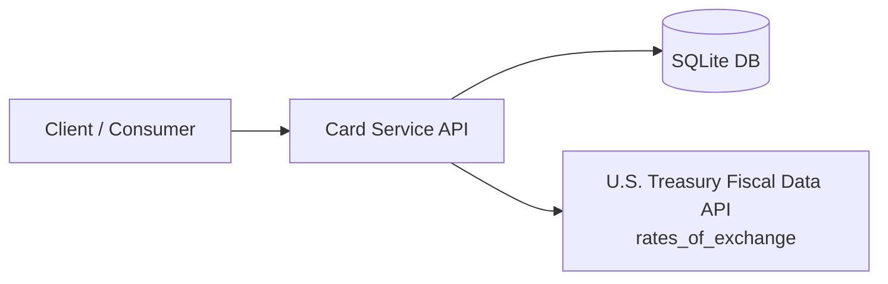
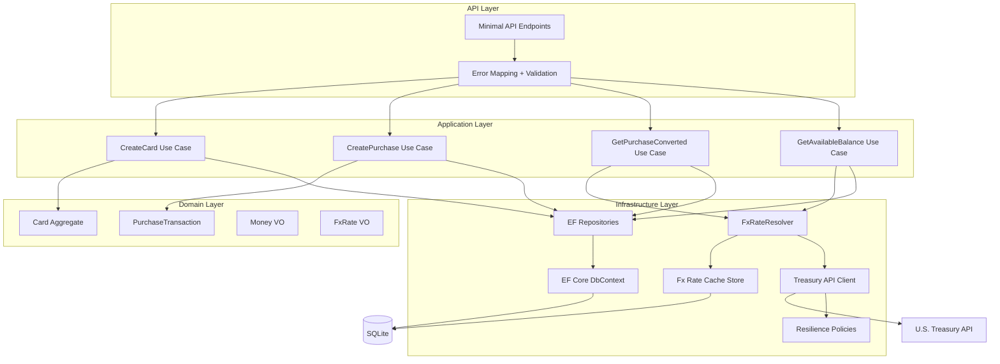
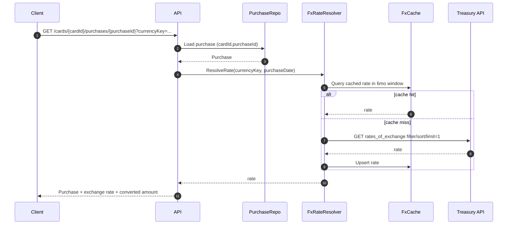
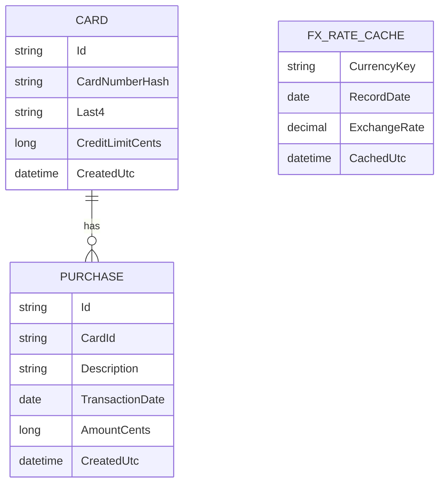

# Architecture Diagrams (Mermaid)

## C4-ish Context Diagram

## Container / Component Diagram

## Sequence — Get Purchase Converted

## Data Model ERD (logical)

---

## Comprehensive Diagram Suite

For detailed architectural documentation including C4 models, sequence diagrams, deployment views, security boundaries, and observability instrumentation, see the **[Diagram Suite Index](../../docs/diagrams/00-index.md)**.

The diagram suite includes:
- **Structural Views**: C4 Context, Container, Component models; Deployment topologies
- **Behavioral Views**: Sequence diagrams for all 4 API endpoints; FX resolution activity flow; Error mapping flowchart
- **Data Views**: ERD with FK relationships; Data Flow Diagrams (layer-to-layer)
- **Cross-Cutting Views**: Security boundaries (card number hashing, TLS, logging redaction); Observability (logging, health checks, metrics, tracing)
